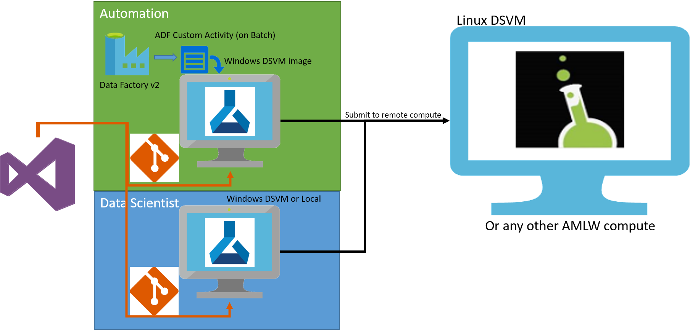

# Schedule Machine Learning Workbench Experimention on Data Factory v2

This sample shows how to leverage ADF to run an experiment. 



## Prerequisites
Create Azure Machine Learning Preview accounts and install Azure Machine Learning Workbench using [these instructions](https://docs.microsoft.com/en-us/azure/machine-learning/preview/quickstart-installation).

## Create Compute Targets

First, create compute targets for running the parameter sweep: DSVM and optionally, HDInsight Spark Cluster. Select **File**, **Open Command Prompt** and enter following commands to create the compute targets.

Create a Ubuntu baesd DSVM using [these instructions](https://docs.microsoft.com/en-us/azure/machine-learning/data-science-virtual-machine/dsvm-ubuntu-intro#create-your-data-science-virtual-machine-for-linux). Attach it as compute target, and then prepare it by using:

```bash
$ az ml computetarget attach --name <dsvm> --address <dsvm-ip> --username <sshusername> --password <sshpwd> --type remotedocker
```

```bash
$ az ml experiment prepare -c <dsvm>
```

OR

Create HDInsight Spark Cluster using [these instructions](https://docs.microsoft.com/en-us/azure/hdinsight/hdinsight-apache-spark-jupyter-spark-sql). Attach it as compute target, and then prepare it by using:

```bash
$ az ml computetarget attach --name <myhdi> --address <myhdi-ssh.azurehdinsight.net> --username <sshusername> --password <sshpwd> --type cluster
```

```bash
$ az ml experiment prepare -c <myhdi>
```


## Run the Model from Local Machine

**Note**: To run sweep_spark.py, you must select DSVM or HDInsight Spark cluster as compute target. The sweep_sklearn.py can run on local Python also.


DSVM run using spark-sklearn

```bash
$ az ml experiment submit -c <dsvm> <pyspark.py>
```

HDInsight Spark run using spark-sklearn:

```bash
$ az ml experiment submit -c <myhdi> <pyspark.py>
```

## Deploy ADFv2 and other required resources

1. Download and place IaC folder within your AML Workspace project directory.
1. Download and place batch task within your AML Workspace project directory.
1. Select **File**, **Open Powershell** and enter the following command to create the deployment.
    1. define a prefix for all resources
    1. define a unique string all lower case
    1. Pick region (ADF will deploy to US East regardless)
    1. Git user
    1. Make Git Access Key
    1. VSTS Server
    1. VSTS Account
    1. Git Project Name
    1. Azure Subscription Name
    1. DSVM Compute Target
    1. Path in AML Workbench project to code
    
```
.\IaC\CreateDeployment.ps1 `
    -prefix "<resource prefix>" `
    -unique "<prefix suffix for uniqueness>" `
    -Location "<region>" `
    -sourceBlobPath "<source data location>" `
    -sinkBlobPath "<sink data location>" `
    -gitPassword "<gitAccessKey>" `
    -subscriptionName "<azure subscription name>" `
    -dsvm "<dsvm>" `
    -pythonPath "<pyspark.py>"
```

## On Batch Windows DSVM Image
### RDP into Node using username `rdpuser`, and provided password. 

### Update Azure PowerShell to >5.X
1. microsoft web platform installer is on the desktop of DSVM, use this to update Powershell

### Install AMLW - MSI must be run from admin cmd.

1. Download AML Workbench from here, https://aka.ms/azureml-wb-msi
1. Windows Key
1. Type `cmd`
1. Right click, select `Run as Admin`
1. Change to D drive with `d:`
1. `cd User\{username}\Downloads`
1. `AmlWorkbenchSetup.msi`
1. Log into AML Workbench, this is required to create starter folders, remote experiment submission will fail if this is not complete.

# Contributing

This project welcomes contributions and suggestions.  Most contributions require you to agree to a
Contributor License Agreement (CLA) declaring that you have the right to, and actually do, grant us
the rights to use your contribution. For details, visit https://cla.microsoft.com.

When you submit a pull request, a CLA-bot will automatically determine whether you need to provide
a CLA and decorate the PR appropriately (e.g., label, comment). Simply follow the instructions
provided by the bot. You will only need to do this once across all repos using our CLA.

This project has adopted the [Microsoft Open Source Code of Conduct](https://opensource.microsoft.com/codeofconduct/).
For more information see the [Code of Conduct FAQ](https://opensource.microsoft.com/codeofconduct/faq/) or
contact [opencode@microsoft.com](mailto:opencode@microsoft.com) with any additional questions or comments.


## Disclaimer
©2017 Microsoft Corporation. All rights reserved. This information is provided "as-is" and may change without notice. Microsoft makes no warranties, express or implied, with respect to the information provided here.
